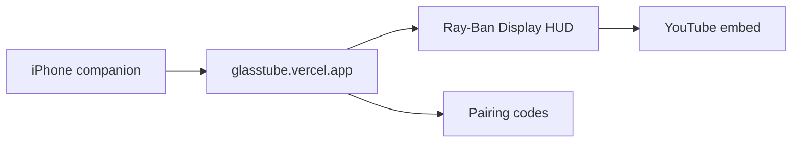

# GlassTube

YouTube on Meta Ray-Ban Display glasses. A 600x600 web HUD, plus an iPhone companion, same idea as GlassNav.

**Live:** [https://glasstube.vercel.app](https://glasstube.vercel.app)  
**Phone:** [https://glasstube.vercel.app/phone](https://glasstube.vercel.app/phone)

Sit still. The picture floats over the real world. Black pixels disappear on the additive display.

## What you can do

On the glasses:

- Recents, channels, and playlists you sent from the phone
- Continue watching from where you left off
- Neural Band: Enter play/pause, Down next, Left back (or previous if you just started a video), Right +10s, Up -10s
- Settings: sound, captions, speed, repeat, shuffle, audio only, sleep timer
- If the network drops, it keeps retrying every few seconds

On the phone:

- Pair once with the six character code
- Send a link, a YouTube playlist, or a list you built
- Play recents as a list
- Reorder playlist videos

Playback uses YouTube's official embed player. Videos that block embedding will show an error. Pick another.

## Add it to the glasses

1. Open the Meta AI app on your iPhone.
2. Devices, Display Glasses settings, App connections, Web apps.
3. Add a web app.
4. Name: GlassTube. URL: `https://glasstube.vercel.app`
5. Open GlassTube from the glasses app list.

On a computer, open the same URL and use arrow keys plus Enter to rehearse. Left is back, because the glasses keep the middle-finger back gesture for their own menu.

## iPhone app

Home screen wrapper, not Safari. Bundle `com.mikeshobes.glasstube`.

- **Phone** tab: pair, paste, playlists
- **Glasses** tab: HUD preview for testing

## Settings

| Control | What it does |
| --- | --- |
| Sound | Mute or unmute YouTube |
| Captions | English captions when the video has them |
| Speed | 1x, 1.25x, 1.5x, 2x |
| Repeat | Off, one video, or the whole list |
| Shuffle | Random order on Play all and phone sends |
| Picture | Full video, or audio only with the poster |
| Sleep timer | Stops playback after 15, 30, 45, or 60 minutes |

## Files

- `index.html`, `styles.css`, `app.js`, `player.js`, `prefs.js`, `sound.js`: glasses HUD
- `phone.html`: companion
- `api/`: pairing, YouTube RSS, oEmbed, playlists
- `ios/`: home screen wrapper

## License

MIT
