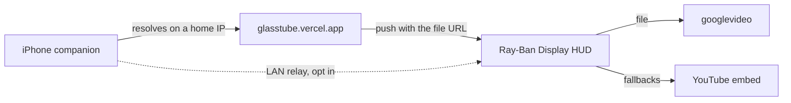

# GlassTube

YouTube on Meta Ray-Ban Display glasses. A 600x600 web HUD, plus an iPhone companion, same idea as GlassNav.

**Live:** [https://glasstube.vercel.app](https://glasstube.vercel.app)  
**Phone:** [https://glasstube.vercel.app/phone](https://glasstube.vercel.app/phone)

Sit still. The picture floats over the real world. Black pixels disappear on the additive display.

## What you can do

On the glasses:

- Search YouTube with the Neural Band, no sign-in and no keyboard: a letter grid you walk with the D-pad, plus your recent searches one pinch away
- Your library, once the phone sends its sign-in: subscriptions, playlists, liked, watch later
- Recents, channels, and playlists you sent from the phone
- Continue watching, per video: every video remembers where you left it, and lists show a red progress line on the thumbnail
- Neural Band: Enter play/pause, Down next, Left back (or previous if you just started a video), Right +10s, Up -10s
- Settings: sound, captions, speed, repeat, shuffle, audio only, sleep timer
- Diagnostics with a self-test that says, out loud, whether the server can fetch video today and whether search still answers
- If the network drops, it keeps retrying every few seconds

On the phone (a real SwiftUI app, not a wrapped web page):

- **Send** - paste or share a link, recently sent, saved videos, your playlists, your channels
- **Search** - native YouTube search, tap a result to send it, or send all 20 at once
- **Library** - subscriptions, playlists, liked and watch later, once you sign in
- **Glasses** - pairing, sending the sign-in across, and a framed preview of the HUD
- **Settings** - appearance, accent, data saver, haptics, account, diagnostics
- Swipe a video to save it, long-press for add-to-playlist / share, drag to reorder a list

Light, dark or system, with six accents. Light mode is designed rather than
inverted: every accent has a separate value per scheme, because a colour bright
enough to carry a dark UI goes pale and illegible on white.

The visual layer is iOS 26's Liquid Glass - `glassEffect`, `.buttonStyle(.glassProminent)`,
a tab bar that minimises on scroll, soft scroll-edge effects. Deployment target
is iOS 26; `Theme.swift` wraps every glass call so an older fallback is one edit.

## How a video actually gets to the glasses

This is the part worth understanding, because YouTube keeps moving it.

YouTube answers datacenter IPs with `LOGIN_REQUIRED` ("Sign in to confirm you're not a bot"), so a server cannot reliably fetch video any more. It also rejects its own API with **403** whenever the request carries a non-YouTube `Origin` header, which a browser always sends — so the glasses cannot fetch it directly either. The phone can: it is on a home IP and it has a real session.

So the phone resolves, and the HUD tries four routes in order, keeping whichever worked last time:

| Route | What it is | When it works |
| --- | --- | --- |
| `file` | `<video>` on the googlevideo file the phone resolved | Glasses and phone share a public IP — same WiFi. Plays inside the HUD, survives the phone sleeping. |
| `proxy` | `<video>` on `/api/watch`, resolved server side | Only for videos YouTube still serves to Vercel. Fails fast when it can't. |
| `embed` | `/embed.html`, the YouTube IFrame API player | Whenever the Meta WebView tolerates a YouTube embed. |
| `go` | `/api/watch?go=1`, a 302 into `youtube.com/embed` | Last resort; YouTube itself becomes the frame document. |

Google signs the resolving IP into the file URL, which is exactly why `file` works on the same WiFi and nowhere else.

The phone also publishes a **LAN relay** (`r`) as an escape hatch. That one is plain HTTP, so an HTTPS HUD can never load it inline — taking it means leaving the HUD for the phone's own play page. It is offered as a button on the error screen, never taken automatically.



## Pairing

You type the six character code **once**. A successful pair also mints a long
link token that both devices keep, and a paired link lives a year past the last
time either device spoke — so reopening the phone app reconnects on its own,
even after the code itself has expired. The code is short lived on purpose:
it is short enough to read off a HUD, which also makes it short enough to guess.

"New code" on the glasses drops the link as well, which is how you move the
glasses to a different phone.

## Not breaking it again

`node scripts/selftest.mjs` exercises the whole chain against production: the
stream resolve, every API, a pair that survives a restart, push → poll with the
file URL intact, and the HUD actually reaching `playing` on both the phone-file
route and the fallback chain. Run it before and after touching the play path.

```
node scripts/selftest.mjs                  # production
node scripts/selftest.mjs --no-browser     # API checks only
npm i playwright-core                      # once, to enable the browser checks
```

It also runs itself. `bash scripts/install-healthcheck.sh` installs a launchd
agent that runs the check daily at 9:07am and stays quiet unless something
fails, in which case it posts a notification. The log is at
`~/Library/Logs/glasstube-health.log`; `--remove` uninstalls it.

The installer copies the scripts to `~/Library/Application Support/GlassTube`
rather than running them from here, because macOS will not let a launchd agent
read `~/Documents` without Full Disk Access. Re-run the installer after editing
`selftest.mjs` to refresh that copy. macOS may also ask once to allow
notifications from Script Editor.

The two failures that have actually happened are both guarded now:

- **Version skew.** Every push carries the iPhone build. If the phone is older
  than the HUD needs, Diagnostics names it and the error says "update the
  iPhone app" instead of blaming YouTube. This is what silently broke playback
  in September 2026 — a HUD shipped expecting a payload the installed phone
  build had no code to send.
- **Pair expiry.** See above; the link no longer dies with the code.
- **YouTube's Atom feeds rate-limit in bursts**, answering 404 or 500 several
  times in a row for a channel that is perfectly fine. Feeds are retried and
  then cached, and a burst serves the last good copy rather than an error.

## Add it to the glasses

1. Open the Meta AI app on your iPhone.
2. Devices, Display Glasses settings, App connections, Web apps.
3. Add a web app.
4. Name: GlassTube. URL: `https://glasstube.vercel.app`
5. Open GlassTube from the glasses app list.

On a computer, open the same URL and use arrow keys plus Enter to rehearse. Left is back, because the glasses keep the middle-finger back gesture for their own menu. On the search screen a real keyboard types straight into the field.

## iPhone app

Native SwiftUI, five tabs, bundle `com.mikeshobes.glasstube`. Version 2.0 onward;
everything before that was `phone.html` in a WKWebView.

| File | What it holds |
| --- | --- |
| `Models.swift` | `Video`, `ChannelRef`, `NamedList`, `Account`, `SendOutcome` |
| `Theme.swift` | appearance mode, accents per scheme, glass helpers, haptics |
| `Store.swift` | app state, Keychain for the Google session, UserDefaults for lists |
| `API.swift` | typed async client for every server endpoint |
| `SendView` / `SearchView` / `LibraryView` / `GlassesView` / `SettingsView` | the five tabs |
| `WebScreen.swift` | the stream resolver, plus the HUD preview's web view |

The one thing that is still a web view is the HUD preview, because the HUD
genuinely is a 600x600 web page - drawing a native mock-up of it would be a
picture of the thing rather than the thing.

`StreamResolver` and `MediaRelay` are untouched by the rewrite: resolving the
file has to happen in native code on this phone's own IP, and that was already
where it lived.

"Send sign-in to glasses" hands this phone's Google session to the paired glasses so they can read your library on their own. It is your credential travelling over the pairing channel, so only do it on glasses you own. Signing out on the phone clears it on both.

`phone.html` is still served at `/phone` as the browser fallback for anyone
without the app installed.

## Settings

| Control | What it does |
| --- | --- |
| Sound | Mute or unmute |
| Captions | English captions when the video has them (embed routes only) |
| Speed | 1x, 1.25x, 1.5x, 2x |
| Repeat | Off, one video, or the whole list |
| Shuffle | Random order on Play all and phone sends |
| Picture | Full video, or audio only with the poster |
| Sleep timer | Stops playback after 15, 30, 45, or 60 minutes |

## Files

- `index.html`, `styles.css`, `app.js`, `player.js`, `prefs.js`, `sound.js`: glasses HUD
- `phone.html`: browser fallback for the companion
- `api/`: pairing, push, YouTube RSS and search, oEmbed, stream resolve, Google auth
- `ios/`: the native iPhone app
- `scripts/selftest.mjs`: end-to-end check, see below

Vercel's Hobby plan allows twelve serverless functions, which is why `/api/search`
is a rewrite onto `api/feed.js` rather than its own file. Keep an eye on that
count before adding an endpoint.

## License

MIT
